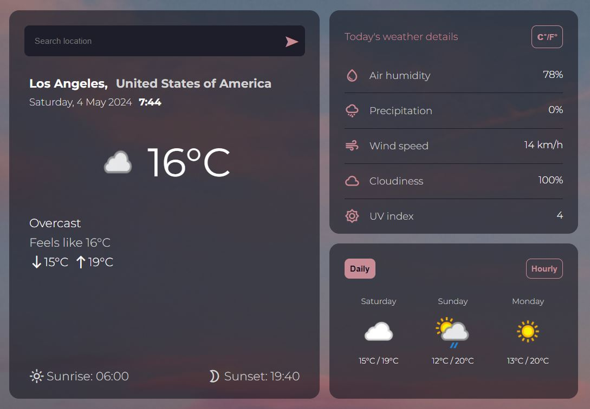

# Weather App

### **Description**

A minimalistic weather forecast app adapted primarily for small screens.

#### 🔗 [Live preview](https://dimar1510.github.io/weather-app/)

### **Features**

- Get the weather forecast for a given location
- Imperial and metric units
- Forecast for 3 nearest days
- Hourly podcast for today
- Your settings and location are saved in your browser

### **Built With**

- TypeScript
- SCSS
- Webpack

#### 🔗 [Weather API](https://www.weatherapi.com/)
